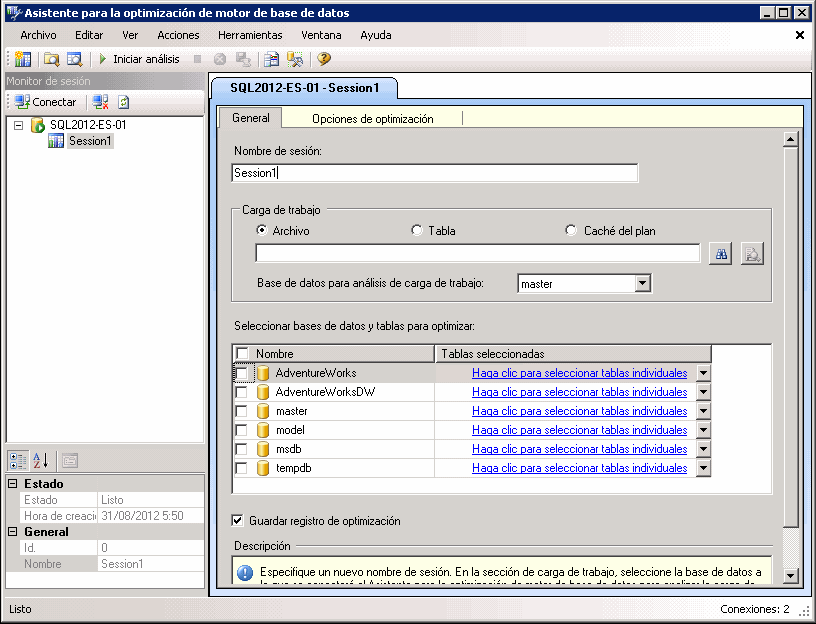

# Lección 1: 1: iniciar el Asistente para la optimización de motor de base de datos
[!INCLUDE[appliesto-ss-xxxx-xxxx-xxx-md](../../includes/appliesto-ss-xxxx-xxxx-xxx-md.md)]Para comenzar, abra la interfaz gráfica de usuario de Asistente para la optimización de motor de base de datos (GUI). La primera vez que se usa, un miembro del rol fijo de servidor **sysadmin** debe iniciar el Asistente para la optimización de motor de base de datos para inicializar la aplicación. Tras la inicialización, los miembros del rol fijo de base de datos **db_owner** pueden usar el asistente para optimizar bases de datos de su propiedad. Para obtener más información sobre cómo inicializar el Asistente para la optimización de motor de base de datos, consulte [Iniciar y usar el Asistente para la optimización de motor de base de datos](../../relational-databases/performance/start-and-use-the-database-engine-tuning-advisor.md).  
  
### Abrir la GUI del Asistente para la optimización de motor de base de datos  
  
1.  En el menú **Inicio** de Windows, elija **Todos los programas**, [!INCLUDE[ssCurrentUI](../../includes/sscurrentui-md.md)]y **Herramientas de rendimiento**y, después, haga clic en **Asistente para la optimización de motor de base de datos**.  
  
2.  En el cuadro de diálogo **Conectar al servidor** , compruebe la configuración predeterminada y, después, haga clic en **Conectar**.  
  
De manera predeterminada, el Asistente para la optimización de motor de base de datos abre la configuración que muestra la ilustración siguiente:  
  
  
  
> [!NOTE]  
> La pestaña y el cuadro **Nombre de sesión** muestran el nombre del equipo y la instancia a la que está conectado. La pestaña y el cuadro también muestran la fecha y la hora actuales.  
  
Cuando se abre por primera vez, aparecen dos paneles principales en la GUI del Asistente para la optimización de motor de base de datos.  
  
-   El panel izquierdo contiene el Monitor de sesión, que enumera todas las sesiones de optimización que se han realizado en esta instancia de [!INCLUDE[msCoName](../../includes/msconame-md.md)] [!INCLUDE[ssNoVersion](../../includes/ssnoversion-md.md)] . Al abrir el Asistente para la optimización de motor de base de datos, mostrará una sesión nueva en la parte superior del panel. Puede nombrar esta sesión en el panel adyacente. Inicialmente, solo se muestra una sesión predeterminada. Ésta es la sesión predeterminada que el Asistente para la optimización de motor de base de datos crea automáticamente para el usuario. Después de optimizar las bases de datos, todas las sesiones de optimización para la instancia de [!INCLUDE[ssNoVersion](../../includes/ssnoversion-md.md)] a las que está conectado se enumerarán debajo de la sesión nueva. Puede hacer clic con el botón secundario en la sesión para cambiarle el nombre, cerrarla, eliminarla o clonarla. Si hace clic con el botón secundario en la lista, podrá ordenar las sesiones por nombre, estado u hora de creación, o bien crear una sesión nueva. En la sección inferior de este panel, se muestran detalles acerca de la sesión de optimización seleccionada. Puede mostrar los detalles organizados por categorías con el botón **Por categorías** , o bien mostrarlos en una lista alfabética usando el botón **Alfabético** . También puede ocultar el Monitor de sesión arrastrando el borde del panel derecho hacia la parte izquierda de la ventana. Para volver a verlo, arrastre el borde del panel hacia la derecha. El Monitor de sesión le permite ver sesiones de optimización previas, o bien utilizarlas para crear sesiones nuevas con definiciones similares. También puede utilizar el Monitor de sesión para evaluar recomendaciones de optimización. Para obtener más información, vea [Ver y trabajar con la salida del Asistente para la optimización de motor de base de datos](../../relational-databases/performance/view-and-work-with-the-output-from-the-database-engine-tuning-advisor.md). Use el botón **Atrás** del explorador para volver a este tutorial.  
  
-   El panel derecho contiene las pestañas **General** y **Opciones de optimización** . Aquí es donde puede definir la sesión de optimización del motor de base de datos. En la pestaña **General** , escriba el nombre de la sesión de optimización, especifique la tabla o el archivo de carga de trabajo que se va a usar y seleccione las bases de datos y tablas que quiere optimizar en esta sesión. Una carga de trabajo es un conjunto de instrucciones [!INCLUDE[tsql](../../includes/tsql-md.md)] que se ejecuta en una o varias bases de datos que se desean optimizar. El Asistente para la optimización de motor de base de datos utiliza archivos de seguimiento, tablas de seguimiento, scripts [!INCLUDE[tsql](../../includes/tsql-md.md)] o archivos XML como entrada de carga de trabajo a la hora de optimizar bases de datos. En la pestaña **Opciones de optimización** , puede seleccionar las estructuras de diseño físico de base de datos (índices o vistas indizadas) y la estrategia de partición que quiere que el asistente tenga en cuenta durante el análisis. En esta pestaña, también puede especificar el tiempo máximo que el Asistente para la optimización de motor de base de datos empleará en optimizar una carga de trabajo. De forma predeterminada, el asistente emplea una hora en optimizar una carga de trabajo.  
  
> [!NOTE]  
> El Asistente para la optimización de motor de base de datos admite archivos XML como entrada cuando se importa un script de [!INCLUDE[tsql](../../includes/tsql-md.md)] desde el Editor de consultas de [!INCLUDE[msCoName](../../includes/msconame-md.md)][!INCLUDE[ssManStudioFull](../../includes/ssmanstudiofull-md.md)] . Para obtener más información, consulte la sección sobre cómo iniciar el Asistente para la optimización de motor de base de datos desde el Editor de consultas de [!INCLUDE[ssManStudioFull](../../includes/ssmanstudiofull-md.md)] en [Iniciar y usar el Asistente para la optimización de motor de base de datos](../../relational-databases/performance/start-and-use-the-database-engine-tuning-advisor.md).  
  
## Siguiente tarea de la lección  
[Configurar las opciones de herramienta y el diseño](../../tools/dta/lesson-1-2-setting-tool-options-and-layout.md)  
  
  
  
