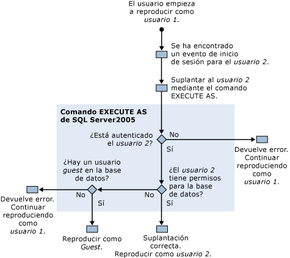

# Permisos necesarios para ejecutar SQL Server Profiler
[!INCLUDE[appliesto-ss-xxxx-xxxx-xxx-md](../../includes/appliesto-ss-xxxx-xxxx-xxx-md.md)]De forma predeterminada, ejecuta [!INCLUDE[ssSqlProfiler](../../includes/sssqlprofiler-md.md)] requiere los mismos permisos de usuario como los procedimientos almacenados de Transact-SQL que se usan para crear seguimientos. Para ejecutar [!INCLUDE[ssSqlProfiler](../../includes/sssqlprofiler-md.md)], debe concederse a los usuarios el permiso ALTER TRACE. Para obtener más información, vea [GRANT &#40;permisos de servidor de Transact-SQL&#41;](../../t-sql/statements/grant-server-permissions-transact-sql.md).  
  
> [!IMPORTANT]  
>  Los usuarios que tienen el permiso SHOWPLAN, ALTER TRACE o VIEW SERVER STATE pueden ver consultas capturadas en la salida del plan de presentación. Estas consultas pueden contener información confidencial, como contraseñas. Por consiguiente, se recomienda conceder estos permisos solo a los usuarios que tengan autorización para ver información confidencial, como los miembros del rol fijo de base de datos db_owner o los miembros del rol fijo de servidor sysadmin. Además, se recomienda guardar solo los archivos del plan de presentación o los archivos de seguimiento que contengan eventos relacionados con el plan de presentación en una ubicación que utilice el sistema de archivos NTFS, así como restringir el acceso a los usuarios que tengan autorización para ver información confidencial.  
  
## Permisos utilizados para reproducir seguimientos  
 La reproducción de seguimientos también requiere que el usuario que reproduce el seguimiento disponga del permiso ALTER TRACE.  
  
 Sin embargo, durante la reproducción, [!INCLUDE[ssSqlProfiler](../../includes/sssqlprofiler-md.md)] utiliza el comando EXECUTE AS si se encuentra un evento Audit Login en el seguimiento que se está reproduciendo. [!INCLUDE[ssSqlProfiler](../../includes/sssqlprofiler-md.md)] utiliza el comando EXECUTE AS para suplantar al usuario asociado al evento de inicio de sesión.  
  
 Si el [!INCLUDE[ssSqlProfiler](../../includes/sssqlprofiler-md.md)] encuentra un evento de inicio de sesión en un seguimiento que se está reproduciendo, se realizan las siguientes comprobaciones de permisos:  
  
1.  El usuario 1, que tiene el permiso ALTER TRACE, comienza a reproducir una seguimiento.  
  
2.  Se encuentra un evento de inicio de sesión para el usuario 2 en la seguimiento reproducida.  
  
3.  [!INCLUDE[ssSqlProfiler](../../includes/sssqlprofiler-md.md)] utiliza el comando EXECUTE AS para suplantar al usuario 2.  
  
4.  [!INCLUDE[ssNoVersion](../../includes/ssnoversion-md.md)] intenta autenticar al usuario 2 y, en función del resultado, tiene lugar una de las siguientes acciones:  
  
    1.  Si el usuario 2 no se puede autenticar, el [!INCLUDE[ssSqlProfiler](../../includes/sssqlprofiler-md.md)] devuelve un error y continúa reproduciendo la seguimiento como usuario 1.  
  
    2.  Si el usuario 2 se autentica correctamente, la reproducción de la seguimiento como usuario 2 continúa.  
  
5.  Los permisos del usuario 2 se comprueban en la base de datos de destino y, en función del resultado, tiene lugar una de las siguientes acciones:  
  
    1.  Si el usuario 2 tiene permisos en la base de datos de destino, la suplantación ha tenido éxito y la seguimiento se reproduce como usuario 2.  
  
    2.  Si el usuario 2 no tiene permisos en la base de datos de destino, el servidor busca un usuario Invitado en esa base de datos.  
  
6.  Se comprueba la existencia de un usuario Invitado en la base de datos de destino y, en función del resultado, tiene lugar una de las siguientes acciones:  
  
    1.  Si existe una cuenta Invitado, la seguimiento se reproduce como la cuenta Invitado.  
  
    2.  Si no existe una cuenta Invitado en la base de datos de destino, se devuelve un error y la seguimiento se reproduce como el usuario 1.  
  
 En el siguiente diagrama se muestra el proceso de comprobación de permisos al reproducir seguimientos:  
  
   
  
## Vea también  
 [Procedimientos almacenados de SQL Server Profiler &#40;Transact-SQL&#41;](../../relational-databases/system-stored-procedures/sql-server-profiler-stored-procedures-transact-sql.md)   
 [Reproducir seguimientos](../../tools/sql-server-profiler/replay-traces.md)   
 [Crear un seguimiento &#40;SQL Server Profiler&#41;](../../tools/sql-server-profiler/create-a-trace-sql-server-profiler.md)   
 [Reproducir una tabla de seguimiento &#40;SQL Server Profiler&#41;](../../tools/sql-server-profiler/replay-a-trace-table-sql-server-profiler.md)   
 [Reproducir un archivo de seguimiento &#40;SQL Server Profiler&#41;](../../tools/sql-server-profiler/replay-a-trace-file-sql-server-profiler.md)  
  
  
